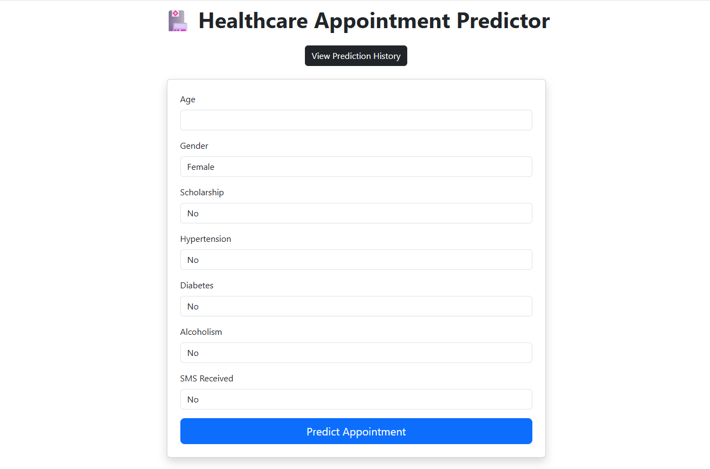
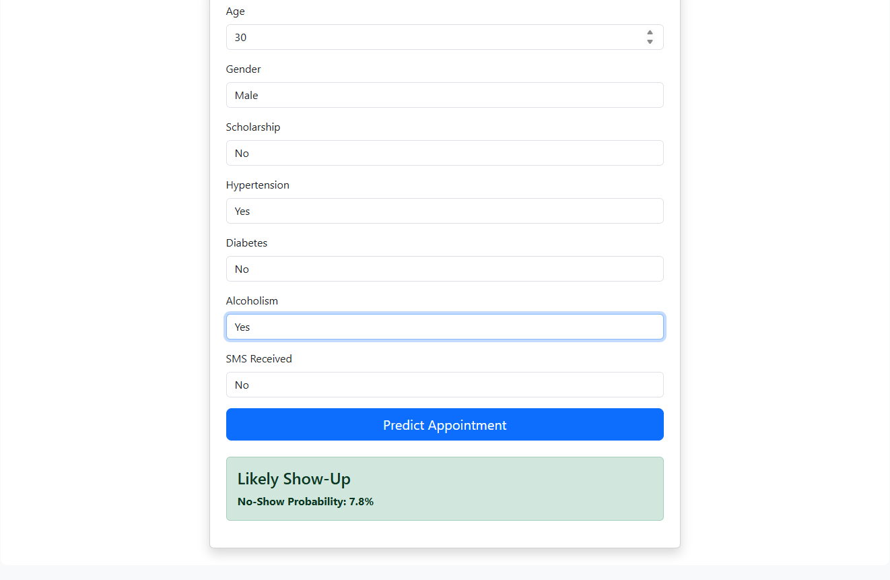
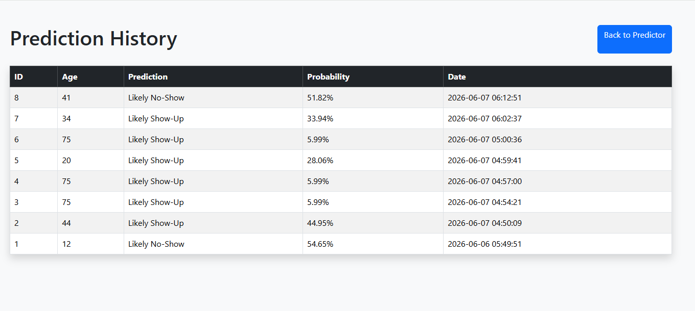

# Healthcare Appointment Intelligence Platform

## Overview

The Healthcare Appointment Intelligence Platform is an end-to-end Data Analytics and Machine Learning project designed to predict whether a patient is likely to miss a healthcare appointment.

This project combines data cleaning, SQL analysis, Power BI visualization, machine learning, and web application development into a single solution.

---

## Objectives

* Analyze healthcare appointment data.
* Identify factors contributing to missed appointments.
* Build an interactive Power BI dashboard.
* Train a Machine Learning model to predict patient no-shows.
* Develop a Flask web application for real-time predictions.
* Store prediction history in a MySQL database.

---

## Features

### Data Analytics

* Data cleaning using Python and Pandas
* Exploratory Data Analysis (EDA)
* SQL-based data analysis
* Power BI interactive dashboard

### Machine Learning

* Random Forest Classifier
* No-show probability prediction
* Feature importance analysis

### Web Application

* User-friendly prediction form
* Real-time appointment prediction
* Probability score generation
* Prediction history tracking

### Database Integration

* MySQL prediction logging
* Historical prediction records
* Timestamped prediction storage

---

## Tech Stack

| Technology   | Purpose                   |
| ------------ | ------------------------- |
| Python       | Data Processing & ML      |
| Pandas       | Data Cleaning             |
| Scikit-Learn | Machine Learning          |
| Flask        | Web Application           |
| MySQL        | Database                  |
| Power BI     | Dashboard & Visualization |
| Git/GitHub   | Version Control           |

---

## Machine Learning Features

The model uses the following features:

* Age
* Gender
* Scholarship
* Hypertension
* Diabetes
* Alcoholism
* SMS Received

---

## Project Architecture

Dataset
→ Data Cleaning (Python)
→ SQL Analysis
→ Power BI Dashboard
→ Machine Learning Model
→ Flask Application
→ MySQL Prediction Logs

---

## Screenshots

### Power BI Dashboard


### Predictor Form


### Prediction Result



### Prediction History



---

## How to Run

### Clone Repository

```bash
git clone https://github.com/your-username/Healthcare-Appointment-Intelligence-Platform.git
cd Healthcare-Appointment-Intelligence-Platform
```

### Install Dependencies

```bash
pip install -r requirements.txt
```

### Run Flask Application

```bash
python app.py
```

Open:

```text
http://127.0.0.1:5000
```

---

## Future Improvements

* Deploy application to cloud platforms
* Email appointment reminders
* Advanced model tuning
* User authentication system
* Real-time analytics dashboard

---

## Author

Kunal Sah

Aspiring Data Analyst | Machine Learning Enthusiast
